# Ruban JS Projects Hub

A premium, interactive showcase of **31 mini-projects** built using raw, vanilla front-end web technologies: **HTML5, CSS3, and JavaScript**.

This repository contains a central glassmorphic portal/dashboard allowing you to browse, filter, search, and launch all projects instantly.

---

## 🚀 How to Run the Projects Locally

To start the local development server and access the interactive projects hub:

1. **Start the HTTP Server**:
   Ensure you have Python installed, then run the following command in the project directory:
   ```powershell
   python -m http.server 3000
   ```
2. **Access the Hub**:
   Open your browser and navigate to: **[http://localhost:3000/](http://localhost:3000/)**
3. **Launch Apps**:
   Browse the 31 cards, search by tags/names, or click **"Launch App"** to run any mini-project in a new tab.

---

## 🎨 Visual Project Architecture (Mermaid Graph)

Here is a visual breakdown of all 31 projects organized by their primary capabilities and categories:

```mermaid
flowchart TD
    %% Custom Styles %%
    classDef games fill:#f472b6,stroke:#db2777,stroke-width:2px,color:#fff;
    classDef apis fill:#38bdf8,stroke:#0284c7,stroke-width:2px,color:#fff;
    classDef media fill:#34d399,stroke:#059669,stroke-width:2px,color:#fff;
    classDef dom fill:#a78bfa,stroke:#7c3aed,stroke-width:2px,color:#fff;
    classDef core fill:#f59e0b,stroke:#d97706,stroke-width:2px,color:#fff;

    Hub([Ruban JS Projects Hub]):::core

    %% Categories %%
    Hub --> Games[🎮 7 Games]:::games
    Hub --> APIs[🌐 6 API Integrations]:::apis
    Hub --> Media[🔊 5 Media & Speech]:::media
    Hub --> Utilities[🛠️ 13 DOM & Utilities]:::dom

    %% Games Branch %%
    Games --> G1[Hangman Game]:::games
    Games --> G2[Typing Game]:::games
    Games --> G3[Memory Cards]:::games
    Games --> G4[Breakout Game]:::games
    Games --> G5[Speak Guess]:::games
    Games --> G6[RGB Guesser]:::games
    Games --> G7[Pixel Artboard]:::games

    %% APIs Branch %%
    APIs --> A1[Exchange Rate]:::apis
    APIs --> A2[Meal Finder]:::apis
    APIs --> A3[Infinite Scroll]:::apis
    APIs --> A4[Lyrics Search]:::apis
    APIs --> A5[QR Generator]:::apis
    APIs --> A6[Weather Dashboard]:::apis

    %% Media Branch %%
    Media --> M1[Video Player]:::media
    Media --> M2[Music Player]:::media
    Media --> M3[Speech Reader]:::media
    Media --> M4[Pomodoro Sounds]:::media
    Media --> M5[Text Reader]:::media

    %% Utilities Branch %%
    Utilities --> U1[Form Validator]:::dom
    Utilities --> U2[Seat Booking]:::dom
    Utilities --> U3[DOM Arrays]:::dom
    Utilities --> U4[Menu Slider]:::dom
    Utilities --> U5[Expense Tracker]:::dom
    Utilities --> U6[Relaxer App]:::dom
    Utilities --> U7[Countdown]:::dom
    Utilities --> U8[Product Filter]:::dom
    Utilities --> U9[Sortable List]:::dom
    Utilities --> U10[Calculator]:::dom
    Utilities --> U11[Study Deck]:::dom
    Utilities --> U12[Sort Visualizer]:::dom
    Utilities --> U13[Voice Notes]:::dom
```



---

## 📁 Project Catalog & Specifications

Below is the complete analysis and specification table of the 31 registered projects, organized by category:

### 🎮 Games
| ID | Project Name | Directory | Tech Stack / APIs | Description |
|:---:|:---|:---|:---|:---|
| 07 | [Hangman Game](file:///c:/Users/HP/Downloads/vanillawebprojects-master/javascript/hangman/index.html) | `hangman/` | SVG, Key Events, Arrays | A retro word-guessing game with dynamic stick-figure rendering. |
| 12 | [Typing Game](file:///c:/Users/HP/Downloads/vanillawebprojects-master/javascript/typing-game/index.html) | `typing-game/` | DOM, Timers, LocalStorage | Beat the clock by typing random words with variable difficulty modes. |
| 14 | [Memory Cards](file:///c:/Users/HP/Downloads/vanillawebprojects-master/javascript/memory-cards/index.html) | `memory-cards/` | 3D CSS Transforms, LocalStorage | Flashcard matching UI utilizing 3D flipping animation blocks. |
| 17 | [Breakout Game](file:///c:/Users/HP/Downloads/vanillawebprojects-master/javascript/breakout-game/index.html) | `breakout-game/` | HTML5 Canvas, 2D Physics | Brick-breaker game featuring collisions, scores, and canvas rendering. |
| 19 | [Speak Number Guess](file:///c:/Users/HP/Downloads/vanillawebprojects-master/javascript/speak-number-guess/index.html) | `speak-number-guess/` | Web Speech API (Recognition) | Guess a number by speaking directly into the microphone. |
| 24 | [RGB Color Guessing Game](file:///c:/Users/HP/Downloads/vanillawebprojects-master/javascript/rgb-guesser/index.html) | `rgb-guesser/` | DOM, Array Methods, Math | Learn color models by matching RGB values to color grids. |
| 25 | [Pixel Art Draw Board](file:///c:/Users/HP/Downloads/vanillawebprojects-master/javascript/pixel-artboard/index.html) | `pixel-artboard/` | Canvas, Flood-Fill, Blob API | Design pixel art on a custom grid and export drawings as PNG. |

### 🌐 API Integration
| ID | Project Name | Directory | Tech Stack / APIs | Description |
|:---:|:---|:---|:---|:---|
| 04 | [Exchange Rate Calculator](file:///c:/Users/HP/Downloads/vanillawebprojects-master/javascript/exchange-rate/index.html) | `exchange-rate/` | Fetch API, JSON, Async | Calculate currency swaps using live foreign exchange rate endpoints. |
| 08 | [Mealfinder App](file:///c:/Users/HP/Downloads/vanillawebprojects-master/javascript/meal-finder/index.html) | `meal-finder/` | Fetch API, DOM | Query dishes and ingredients using search criteria via MealDB API. |
| 11 | [Infinite Scroll Blog](file:///c:/Users/HP/Downloads/vanillawebprojects-master/javascript/infinite_scroll_blog/index.html) | `infinite_scroll_blog/` | Fetch, Scroll API | Auto-loading post feeds that fetch data as the user scrolls. |
| 15 | [Lyrics Search App](file:///c:/Users/HP/Downloads/vanillawebprojects-master/javascript/lyrics-search/index.html) | `lyrics-search/` | Fetch, Audio API, Pagination | Search song lyrics, browse tracks, and play previews. |
| 27 | [QR Code Generator](file:///c:/Users/HP/Downloads/vanillawebprojects-master/javascript/qr-generator/index.html) | `qr-generator/` | Fetch, QR Server API | Instantly creates and downloads custom QR codes for any link. |
| 28 | [Weather & Dynamic Theme](file:///c:/Users/HP/Downloads/vanillawebprojects-master/javascript/weather-theme/index.html) | `weather-theme/` | Async/Await, UI Themes | Dynamic weather widget that alters page themes based on local skies. |

### 🔊 Media & Speech
| ID | Project Name | Directory | Tech Stack / APIs | Description |
|:---:|:---|:---|:---|:---|
| 03 | [Custom Video Player](file:///c:/Users/HP/Downloads/vanillawebprojects-master/javascript/custom-video-player/index.html) | `custom-video-player/` | HTML5 Video Media API | Custom player UI controls with styling for scrubbers and volume. |
| 10 | [Music Player](file:///c:/Users/HP/Downloads/vanillawebprojects-master/javascript/music-player/index.html) | `music-player/` | HTML5 Audio Media API | Audio tracks controller featuring album spins and timeline progress. |
| 13 | [Speech Text Reader](file:///c:/Users/HP/Downloads/vanillawebprojects-master/javascript/speech-text-reader/index.html) | `speech-text-reader/` | Web Speech API (Synthesis) | Multi-voice synthesizer text-to-speech visual helper dashboard. |
| 23 | [Pomodoro & Ambient Sounds](file:///c:/Users/HP/Downloads/vanillawebprojects-master/javascript/pomodoro-sounds/index.html) | `pomodoro-sounds/` | Audio API, Oscillator Noise | Work timer utilizing synthesized rain and ocean wave noise. |
| 29 | [Text Analyzer & Reader](file:///c:/Users/HP/Downloads/vanillawebprojects-master/javascript/text-analyzer/index.html) | `text-analyzer/` | Speech Synthesis, Regex | Calculates counts, keywords, and reads text with dynamic voice pitches. |

### 🛠️ DOM Manipulation & Utilities
| ID | Project Name | Directory | Tech Stack / APIs | Description |
|:---:|:---|:---|:---|:---|
| 01 | [Form Validator](file:///c:/Users/HP/Downloads/vanillawebprojects-master/javascript/form-validator/index.html) | `form-validator/` | DOM, Regex, CSS | Client-side input validation checking passwords, email, and formats. |
| 02 | [Movie Seat Booking](file:///c:/Users/HP/Downloads/vanillawebprojects-master/javascript/movie-seat-booking/index.html) | `movie-seat-booking/` | LocalStorage, SVG | Dynamic ticket price calculation with active seat occupancy storage. |
| 05 | [DOM Array Methods](file:///c:/Users/HP/Downloads/vanillawebprojects-master/javascript/dom-array-methods/index.html) | `dom-array-methods/` | Array Helpers, Fetch | Renders mock income metrics testing foreach, map, sort, and reduce. |
| 06 | [Menu Slider & Modal](file:///c:/Users/HP/Downloads/vanillawebprojects-master/javascript/modal-menu-slider/index.html) | `modal-menu-slider/` | CSS Transitions, Toggle | Navigation menu sidebar and overlays using smooth CSS state transitions. |
| 09 | [Expense Tracker](file:///c:/Users/HP/Downloads/vanillawebprojects-master/javascript/expense-tracker/index.html) | `expense-tracker/` | LocalStorage, Arrays | Tracks positive/negative transactions computing budgets and totals. |
| 16 | [Relaxer App](file:///c:/Users/HP/Downloads/vanillawebprojects-master/javascript/relaxer-app/index.html) | `relaxer-app/` | CSS Keyframe Animations | Breathe-in, hold, and breathe-out mindfulness visual aid. |
| 18 | [New Year Countdown](file:///c:/Users/HP/Downloads/vanillawebprojects-master/javascript/new-year-countdown/index.html) | `new-year-countdown/` | Date Objects, CSS Loaders | Modern timer calculating the exact days/hours/minutes to New Year. |
| 20 | [Product Filtering UI](file:///c:/Users/HP/Downloads/vanillawebprojects-master/javascript/product-filtering/index.html) | `product-filtering/` | Filtering Algorithms | Instantly filters lists of products matching sizes, prices, and tags. |
| 21 | [Sortable List](file:///c:/Users/HP/Downloads/vanillawebprojects-master/javascript/sortable-list/index.html) | `sortable-list/` | HTML5 Drag & Drop API | Draggable lists allowing users to re-rank item indexes. |
| 22 | [Glassmorphic Calculator](file:///c:/Users/HP/Downloads/vanillawebprojects-master/javascript/glass-calculator/index.html) | `glass-calculator/` | CSS Variables, Audio Synth | Theme-switching calculator featuring synthesized keyclick tones. |
| 26 | [Card Study Deck](file:///c:/Users/HP/Downloads/vanillawebprojects-master/javascript/study-deck/index.html) | `study-deck/` | 3D Transforms, LocalStorage | Study tool allowing custom question card deck creation and storage. |
| 30 | [Visual Sorting Simulator](file:///c:/Users/HP/Downloads/vanillawebprojects-master/javascript/sorting-visualizer/index.html) | `sorting-visualizer/` | Promises, Animations | Visualizes Bubble, Selection, and Insertion sorts on arrays. |
| 31 | [Voice Sticky Notes](file:///c:/Users/HP/Downloads/vanillawebprojects-master/javascript/voice-stickies/index.html) | `voice-stickies/` | Speech Recognition, Drag & Drop | Absolute positioned draggable post-it pads created via speech voice. |

---

## 🎨 Hub Design Details

The Hub Dashboard is styled using:
* **Glassmorphic Layout**: Translucent dark surfaces with soft borders (`backdrop-filter: blur(16px)`).
* **Dynamic Search & Filters**: Instantly filter projects by tags, categories, or keywords.
* **Modern Typography**: Integrated using the Google font "Inter" for a clean, professional aesthetic.
