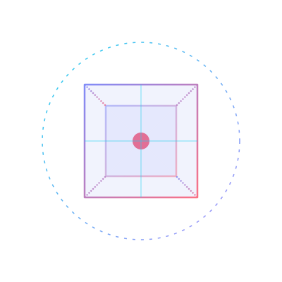

# 🚀 Ruban JS Projects Hub

<p align="center">
  
</p>

<p align="center">
  <strong>An elite showcase of 31 interactive mini-projects crafted using raw vanilla front-end web technologies.</strong>
</p>

<p align="center">
  <a href="https://github.com/RUBANRAJS-hub/javascript-project/stargazers"></a>
  <a href="https://github.com/RUBANRAJS-hub/javascript-project/network/members"></a>
  <a href="https://github.com/RUBANRAJS-hub/javascript-project/blob/main/LICENSE"></a>
</p>

<p align="center">
  
  
  
</p>

---

## ✨ Features

* **Centralized Interactive Hub**: Responsive glassmorphic dashboard to access all 31 projects instantly.
* **Instant Keyword Filtering**: Filter cards live by typing names, tags, or features.
* **Categorical Quick Tags**: Toggle project displays using category filters (Games, APIs, Media, DOM).
* **Fully Responsive UI**: Mobile-friendly grids, smooth hover transitions, and dark/light dynamic styling.
* **Hardware-Accelerated SVGs**: Embedded 3D floating animation renders natively without weight.

---

## 🛠️ Tech Stack

* **Front-End Core**: HTML5 Semantic Layout, CSS3 Grid/Flexbox/Transitions.
* **Logic & APIs**: Vanilla ES6+ JavaScript, Promises, Async/Await, Array Iteration, Key/Mouse Event Listeners.
* **System APIs**: Web Speech API (Synthesis/Recognition), HTML5 Video/Audio APIs, Web Audio API Synthesizers.
* **Storage**: Web Storage API (`localStorage`) for preserving user options, timer histories, and customized decks.

---

## 📁 Folder Structure

The repository organizes projects inside flat directories with the central index portal at the root:

```text
javascript/
├── 3d-cube.svg                # 3D Animation Asset
├── index.html                 # Central Glassmorphic Hub Page
├── readme.md                  # Showcase Documentation
├── breakout-game/             # Project 17
│   ├── index.html
│   ├── script.js
│   └── style.css
├── glass-calculator/          # Project 22
│   └── index.html
├── pomodoro-sounds/           # Project 23
│   └── index.html
└── ... (All other project folders)
```

---

## 🚀 Installation & Local Setup

To run this projects hub locally on your machine:

1. **Clone the repository**:
   ```bash
   git clone https://github.com/RUBANRAJS-hub/javascript-project.git
   cd javascript-project
   ```
2. **Start a local HTTP server**:
   If you have Python installed, launch the server in the root folder:
   ```bash
   python -m http.server 3000
   ```
3. **Launch in Browser**:
   Open **[http://localhost:3000/](http://localhost:3000/)** to access the interactive hub.

---

## 🎮 Project Categories

### 🎮 Games
* **Hangman Game** (07): Word guessing game with animated SVG stick figure.
* **Typing Game** (12): High-speed typing clock-beater with local score saves.
* **Memory Cards** (14): Slide deck study cards utilizing 3D card flips.
* **Breakout Game** (17): Classic canvas brick-breaker with paddle physics.
* **Speak Guess** (19): Voice-controlled number matching helper.
* **RGB Guesser** (24): Color grid guessing game to practice RGB color structures.
* **Pixel Artboard** (25): 8-bit draw board with custom canvas grid colors and PNG export.

### 🌐 API Integrations
* **Exchange Rate** (04): Double currency converter using exchange rate feeds.
* **Meal Finder** (08): Search dishes and recipes using meal databases.
* **Infinite Scroll** (11): Continuous posts scroller.
* **Lyrics Search** (15): Song search with pagination and previews.
* **QR Generator** (27): Dynamic QR code generator with sizing filters.
* **Weather Widget** (28): Weather dashboard that changes site themes based on weather.

### 🔊 Media & Speech
* **Video Player** (03): Video player with styled custom scrubbers.
* **Music Player** (10): Audio player featuring song rotation.
* **Speech Reader** (13): Text reader using dynamic synthesis voices.
* **Pomodoro Sounds** (23): Focus timer with synthesized rain and wave noise.
* **Text Reader** (29): Statistics generator with voice playback control.

---

## 📋 All 31 Projects

| ID | Project Name | Directory | Tech Stack / APIs |
|:---:|:---|:---|:---|
| 01 | [Form Validator](file:///c:/Users/HP/Downloads/vanillawebprojects-master/javascript/form-validator/index.html) | `form-validator/` | DOM Validation, Regex, CSS |
| 02 | [Movie Seat Booking](file:///c:/Users/HP/Downloads/vanillawebprojects-master/javascript/movie-seat-booking/index.html) | `movie-seat-booking/` | LocalStorage, SVG Layouts |
| 03 | [Custom Video Player](file:///c:/Users/HP/Downloads/vanillawebprojects-master/javascript/custom-video-player/index.html) | `custom-video-player/` | HTML5 Video Media API |
| 04 | [Exchange Rate Calculator](file:///c:/Users/HP/Downloads/vanillawebprojects-master/javascript/exchange-rate/index.html) | `exchange-rate/` | Fetch API, Dynamic Flags |
| 05 | [DOM Array Methods](file:///c:/Users/HP/Downloads/vanillawebprojects-master/javascript/dom-array-methods/index.html) | `dom-array-methods/` | Array Helpers, API Fetch |
| 06 | [Menu Slider & Modal](file:///c:/Users/HP/Downloads/vanillawebprojects-master/javascript/modal-menu-slider/index.html) | `modal-menu-slider/` | CSS Overlays, Slide Events |
| 07 | [Hangman Game](file:///c:/Users/HP/Downloads/vanillawebprojects-master/javascript/hangman/index.html) | `hangman/` | SVG graphics, keydown events |
| 08 | [Mealfinder App](file:///c:/Users/HP/Downloads/vanillawebprojects-master/javascript/meal-finder/index.html) | `meal-finder/` | Fetch API, Recipe Searches |
| 09 | [Expense Tracker](file:///c:/Users/HP/Downloads/vanillawebprojects-master/javascript/expense-tracker/index.html) | `expense-tracker/` | LocalStorage, Budget calculations |
| 10 | [Music Player](file:///c:/Users/HP/Downloads/vanillawebprojects-master/javascript/music-player/index.html) | `music-player/` | HTML5 Audio Media API |
| 11 | [Infinite Scroll Blog](file:///c:/Users/HP/Downloads/vanillawebprojects-master/javascript/infinite_scroll_blog/index.html) | `infinite_scroll_blog/` | Fetch API, Scroll calculations |
| 12 | [Typing Game](file:///c:/Users/HP/Downloads/vanillawebprojects-master/javascript/typing-game/index.html) | `typing-game/` | JavaScript timers, LocalStorage |
| 13 | [Speech Text Reader](file:///c:/Users/HP/Downloads/vanillawebprojects-master/javascript/speech-text-reader/index.html) | `speech-text-reader/` | Web Speech API (Synthesis) |
| 14 | [Memory Cards](file:///c:/Users/HP/Downloads/vanillawebprojects-master/javascript/memory-cards/index.html) | `memory-cards/` | CSS 3D Transforms, LocalStorage |
| 15 | [Lyrics Search App](file:///c:/Users/HP/Downloads/vanillawebprojects-master/javascript/lyrics-search/index.html) | `lyrics-search/` | Lyrist API fetches, pagination |
| 16 | [Relaxer App](file:///c:/Users/HP/Downloads/vanillawebprojects-master/javascript/relaxer-app/index.html) | `relaxer-app/` | CSS Animation timelines, timers |
| 17 | [Breakout Game](file:///c:/Users/HP/Downloads/vanillawebprojects-master/javascript/breakout-game/index.html) | `breakout-game/` | HTML5 Canvas, 2D physics |
| 18 | [New Year Countdown](file:///c:/Users/HP/Downloads/vanillawebprojects-master/javascript/new-year-countdown/index.html) | `new-year-countdown/` | Date Objects, CSS spinners |
| 19 | [Speak Number Guess](file:///c:/Users/HP/Downloads/vanillawebprojects-master/javascript/speak-number-guess/index.html) | `speak-number-guess/` | Web Speech API (Recognition) |
| 20 | [Product Filtering UI](file:///c:/Users/HP/Downloads/vanillawebprojects-master/javascript/product-filtering/index.html) | `product-filtering/` | Array filters, search bars |
| 21 | [Sortable List](file:///c:/Users/HP/Downloads/vanillawebprojects-master/javascript/sortable-list/index.html) | `sortable-list/` | HTML5 Drag & Drop API |
| 22 | [Glassmorphic Calculator](file:///c:/Users/HP/Downloads/vanillawebprojects-master/javascript/glass-calculator/index.html) | `glass-calculator/` | CSS variables, Web Audio Synthesizer |
| 23 | [Pomodoro & Ambient Sounds](file:///c:/Users/HP/Downloads/vanillawebprojects-master/javascript/pomodoro-sounds/index.html) | `pomodoro-sounds/` | Synthesized rain & wave oscillators |
| 24 | [RGB Color Guessing Game](file:///c:/Users/HP/Downloads/vanillawebprojects-master/javascript/rgb-guesser/index.html) | `rgb-guesser/` | Math operations, element grids |
| 25 | [Pixel Art Draw Board](file:///c:/Users/HP/Downloads/vanillawebprojects-master/javascript/pixel-artboard/index.html) | `pixel-artboard/` | Canvas drawings, flood-fill algorithm |
| 26 | [Card Study Deck](file:///c:/Users/HP/Downloads/vanillawebprojects-master/javascript/study-deck/index.html) | `study-deck/` | 3D rotations, LocalStorage saving |
| 27 | [QR Code Generator](file:///c:/Users/HP/Downloads/vanillawebprojects-master/javascript/qr-generator/index.html) | `qr-generator/` | QRserver API, download blobs |
| 28 | [Weather & Dynamic Theme](file:///c:/Users/HP/Downloads/vanillawebprojects-master/javascript/weather-theme/index.html) | `weather-theme/` | Dynamic UI themes, weather databases |
| 29 | [Text Analyzer & Reader](file:///c:/Users/HP/Downloads/vanillawebprojects-master/javascript/text-analyzer/index.html) | `text-analyzer/` | String calculations, Speech synthesis |
| 30 | [Visual Sorting Simulator](file:///c:/Users/HP/Downloads/vanillawebprojects-master/javascript/sorting-visualizer/index.html) | `sorting-visualizer/` | Promises, animated array delays |
| 31 | [Voice Sticky Notes](file:///c:/Users/HP/Downloads/vanillawebprojects-master/javascript/voice-stickies/index.html) | `voice-stickies/` | SpeechRecognition dictations, Dragging |

---

## 📈 Repository Stats

<p align="center">
  
  
</p>

---

## 🤝 Contribution

Contributions are always welcome!
1. Fork the Project.
2. Create your Feature Branch (`git checkout -b feature/AmazingFeature`).
3. Commit your Changes (`git commit -m 'Add some AmazingFeature'`).
4. Push to the Branch (`git push origin feature/AmazingFeature`).
5. Open a Pull Request.

---

## 📄 License

Distributed under the **MIT License**. See `LICENSE` for more information.

---

## 👨‍💻 About Me

* **GitHub**: [@RUBANRAJS-hub](https://github.com/RUBANRAJS-hub)
* **Design Philosophy**: High-fidelity UI layouts, glassmorphism, and clean code optimization.

---

<p align="center">
  <strong>Made with ❤️ by Ruban Raj S</strong>
</p>
